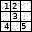
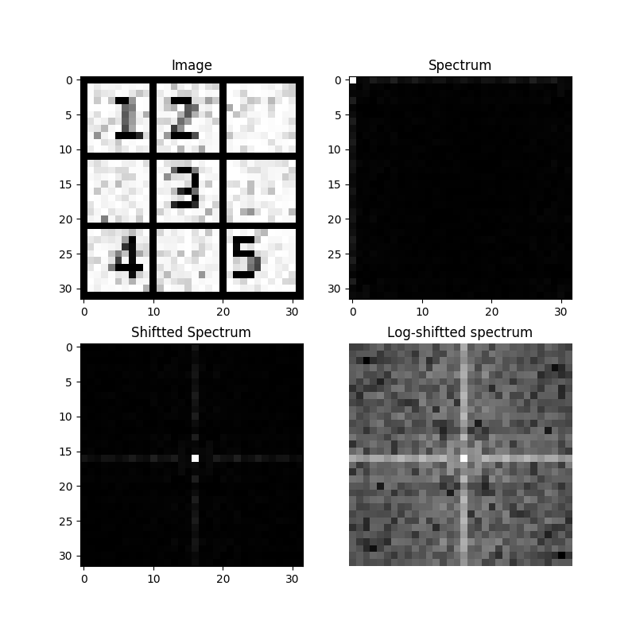
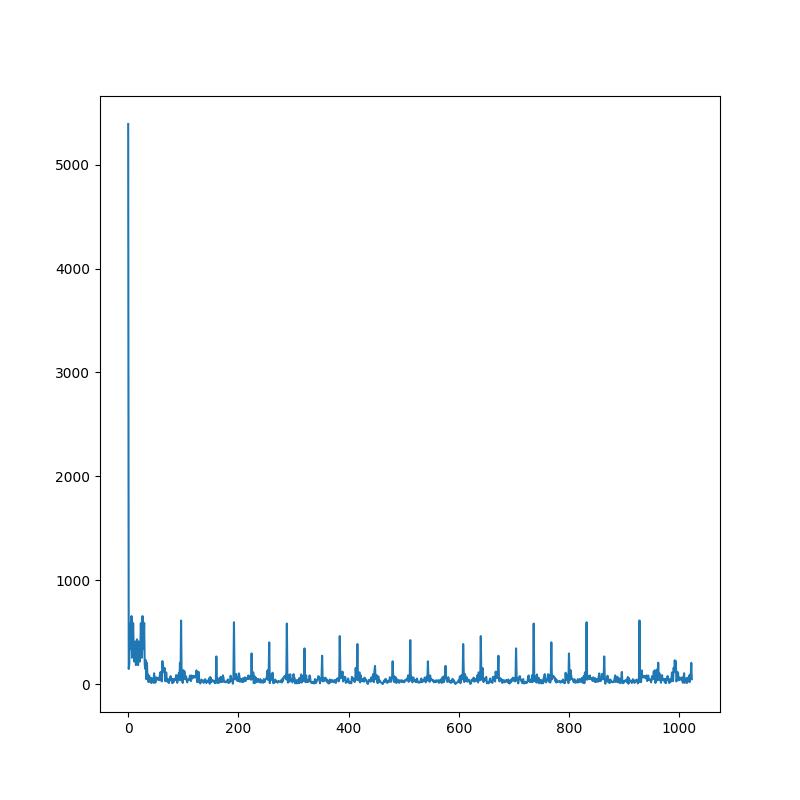
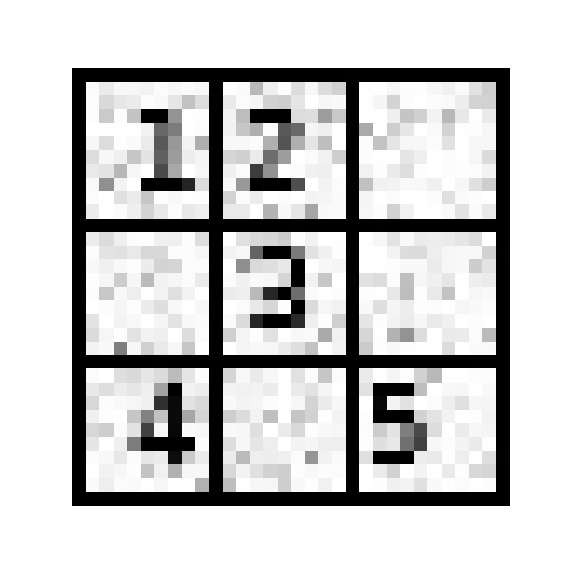

# SCC0251 - Short Assignment 1: Filtering in Fourier Domain

In this assignment we had to implement DFT 2D and Inverse DFT 2D using only numpy. 

The program takes as input only an image filename (that must be loaded into memory) and a float number.

In this repo, we provide an optimised implementation of the 2D Fourier Transform and 2D Inversed Fourier Transform using matrix operations into numpy.

The input images are grayscaled and in the unit8 format.

## Fourrier application example:

### 1) Reference Image

### 2) Spectrum Analysis - Fourier Transform 

### 3) Frequency Analysis

### 4) New Image - Inverse Fourier Transform

